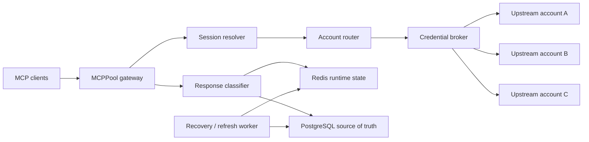

# MCPPool

> Multi-account pooling and quota-aware routing gateway for Model Context Protocol services.

MCPPool exposes one stable MCP endpoint in front of multiple accounts for the same upstream service. It keeps sessions sticky, selects healthy accounts, pauses exhausted accounts, and safely fails over when an account becomes unavailable.

> [!IMPORTANT]
> MCPPool is in early development. The initial milestone focuses on Streamable HTTP, API-key accounts, session affinity, quota-aware routing, and Context7 as the first provider adapter.

## Why MCPPool?

A normal reverse proxy knows hosts and connections. MCPPool also understands:

- MCP sessions and JSON-RPC method boundaries
- accounts versus credentials
- account health, concurrency, cooldowns, and quota reset times
- session-affine account selection
- safe versus unsafe cross-account retries
- provider-specific quota and authentication signals

## Architecture



The project is split into three logical planes:

1. **Data plane** — authenticates clients, resolves sessions, selects an account, injects credentials, and streams the upstream response.
2. **Control plane** — manages services, accounts, credentials, routing policies, quota state, and manual overrides.
3. **Worker plane** — refreshes OAuth credentials, probes paused accounts, and reactivates accounts after quota resets.

## Technology stack

| Area | Choice |
| --- | --- |
| Runtime | Python 3.12+ |
| Dependency management | uv |
| HTTP / ASGI | FastAPI, Starlette, Uvicorn |
| Upstream transport | httpx with HTTP/2 and streaming |
| MCP SDK | Official Python SDK v1.x, pinned below v2 |
| Persistent state | PostgreSQL + SQLAlchemy async |
| Runtime state | Redis |
| Validation / settings | Pydantic v2 + pydantic-settings |
| Secrets | Envelope encryption using `cryptography` |
| Observability | Prometheus metrics + structured logs + OpenTelemetry-ready boundaries |
| Quality | Ruff, mypy, pytest |

See [docs/architecture.md](docs/architecture.md) and the [architecture decisions](docs/adr/) for the reasoning behind these choices.

## Routing model

MCPPool treats an **account** as the quota owner and a **credential** as authentication material. Multiple credentials may belong to one account and still share the same upstream quota.

The planned default routing policy is:

- weighted rendezvous hashing for new sessions
- session affinity for subsequent requests
- least-inflight fallback for requests without a stable session key
- automatic exclusion of paused, unhealthy, expired, or saturated accounts
- provider-aware cooldown and quota reset handling

## Development

Prerequisites:

- Python 3.12+
- uv
- Docker with Compose, for PostgreSQL and Redis

```bash
cp .env.example .env
docker compose up -d postgres redis
uv sync --all-groups
uv run mcp-pool serve --reload
```

Then open:

- `http://127.0.0.1:8000/health/live`
- `http://127.0.0.1:8000/health/ready`
- `http://127.0.0.1:8000/docs`

Run checks:

```bash
uv run ruff check .
uv run ruff format --check .
uv run mypy src
uv run pytest
```

## Initial roadmap

- [x] Repository and application skeleton
- [ ] Streamable HTTP reverse proxy
- [ ] Account and credential persistence
- [ ] Session binding and weighted rendezvous routing
- [ ] Quota classifier and account state machine
- [ ] Context7 provider adapter
- [ ] Prometheus metrics and request audit trail
- [ ] OAuth refresh and recovery worker
- [ ] Administration API and dashboard

## Design principles

- Preserve upstream MCP messages and streaming behavior whenever possible.
- Never log raw credentials, authorization headers, or refresh tokens.
- Persist long-lived quota pauses in PostgreSQL; Redis is an acceleration layer, not the source of truth.
- Do not retry `tools/call` across accounts unless the tool is explicitly configured as idempotent.
- Keep provider-specific behavior behind adapters instead of embedding it in the router.
