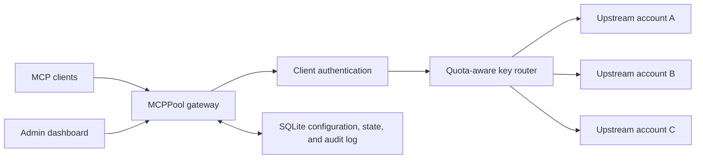

# MCPPool

> Multi-account pooling and quota-aware routing gateway for Model Context Protocol services.

MCPPool exposes one stable MCP endpoint in front of multiple API-key accounts for the same
upstream service. It rotates eligible accounts, enforces configured monthly quotas, persists
account health in SQLite, keeps MCP sessions on their original account, and fails over only when
retrying is safe.

> [!IMPORTANT]
> MCPPool currently targets a simple single-node deployment backed by SQLite. Context7 is the
> first provider adapter.

## Why MCPPool?

A normal reverse proxy knows hosts and connections. MCPPool also understands:

- MCP sessions and JSON-RPC method boundaries
- upstream accounts and encrypted credentials
- account health, cooldowns, and configured monthly quotas
- Gateway API-key authentication
- safe versus ambiguous cross-account retries
- provider-specific quota and authentication signals

## Architecture



The project has two logical paths:

1. **Proxy path** — authenticates clients, selects an eligible account, injects its decrypted
   credential, classifies the result, and streams the upstream response.
2. **Administration path** — manages services, credentials, client keys, quotas, users, settings,
   and request logs.

## Technology stack

| Area | Choice |
| --- | --- |
| Runtime | Python 3.12+ |
| Dependency management | uv |
| HTTP / ASGI | FastAPI, Starlette, Uvicorn |
| Upstream transport | httpx streaming |
| Persistent and runtime state | SQLite + SQLAlchemy async |
| Validation / settings | Pydantic v2 + pydantic-settings |
| Secrets | Fernet encryption for upstream keys; HMAC for Gateway keys |
| Administration UI | React + Vite + nginx |
| Quality | Ruff, mypy, pytest |

See [docs/architecture.md](docs/architecture.md), the [architecture decisions](docs/adr/), and the
[operations runbook](docs/operations.md) for design and production procedures.

## Routing model

Each configured API key is currently one independently routed account. Eligible keys are selected
smooth weighted round-robin. A key is excluded when it is disabled, rejected by the upstream,
inside a rate-limit cooldown, or at its configured monthly quota. In-flight requests reserve quota
inside the single gateway process so concurrent requests cannot all claim the final local unit.

When an upstream returns `Mcp-Session-Id`, MCPPool binds that session to the selected service key.
Bindings are process-local, bounded, and expire after 24 hours by default. A deployment restart
therefore invalidates affinity for existing upstream sessions.

Explicit upstream rejections (`401`, `403`, or `429`) may fail over to another account. Ambiguous
failures such as connection loss or `5xx` responses are retried only for HTTP/MCP operations known
to be read-only. `tools/call` is not replayed after an ambiguous failure.

## Context7 quota status

For Context7 services, the account table can display the upstream request limit, used and
remaining requests, reset time, snapshot age, and the latest safe error state for every key. These
values are kept separate from MCPPool's locally configured `monthly_quota` and request-log count.

When a successful Context7 `tools/call` response includes complete `RateLimit-Limit`,
`RateLimit-Remaining`, and `RateLimit-Reset` headers, MCPPool stores those official values. When
Context7 omits the headers, MCPPool advances an existing, unexpired official snapshot by one and
marks the displayed value as a local estimate. Handshake, notification, discovery, and session
close requests are not added. The dashboard polls only MCPPool's persisted state, so leaving the
page open does not consume Context7 quota.

Click **Query now** to establish or calibrate the official baseline, including usage made outside
MCPPool. The fixed official HEAD query consumes one Context7 request itself, and the UI confirms
that cost before sending it. A successful query also recalculates the local manual offset so the
separate **Local Usage / Manual Quota** column matches the effective official used value at that
moment. A failed query leaves the previous offset unchanged.

A local estimate cannot be shown before the first successful official query. After the saved reset
time, the old value remains visible as stale but receives no further local increments until another
official query establishes the new period.

Administration endpoints:

- `GET /api/admin/services/{service_id}/quota-status` reads the saved snapshot without contacting
  Context7.
- `POST /api/admin/services/{service_id}/quota-status/refresh?key_id={key_id}` refreshes one key.
  Omitting `key_id` refreshes up to 20 keys in that Context7 service with globally bounded
  concurrency. Per-key singleflight and a short cooldown prevent duplicate refreshes from
  consuming quota.

Context7's web-only teamspace statistics endpoint requires a privileged browser session and does
not accept the `ctx7sk-*` API keys stored by MCPPool. MCPPool therefore never stores Context7
browser cookies, account passwords, or billing-session credentials.

## Development

Prerequisites:

- Python 3.12+
- uv
- Docker with Compose, when running the packaged gateway and dashboard

```bash
cp .env.example .env
# Set two unique secrets in .env before the first startup:
# MCP_POOL_SECRET_KEY=$(openssl rand -hex 32)
# MCP_POOL_INITIAL_ADMIN_PASSWORD=$(openssl rand -base64 24)
uv sync --all-groups
uv run mcp-pool serve --reload
```

Or run the complete local deployment:

```bash
docker compose up -d --build
```

Then open:

- `http://127.0.0.1:8000/health/live`
- `http://127.0.0.1:8000/health/ready`
- `http://127.0.0.1:8000/docs` for a direct development run
- `http://127.0.0.1:8000/metrics` for Prometheus metrics
- `http://127.0.0.1:3000` for the Docker dashboard
- `http://127.0.0.1:8100/health/ready` for the Docker gateway

Run checks:

```bash
uv run ruff check .
uv run ruff format --check .
uv run mypy src tests
uv run pytest --cov=mcp_pool --cov-fail-under=85
cd web
npm ci
npm run lint
npm test
npm run build
npm run e2e
```

On first startup, sign in with username `admin` and the password supplied through
`MCP_POOL_INITIAL_ADMIN_PASSWORD`, then create a Gateway API key under Settings. Proxy requests are
denied when no Gateway API key exists. Anonymous proxying requires the explicit
`MCP_POOL_ALLOW_ANONYMOUS_GATEWAY=true` escape hatch and is not recommended.

## Production configuration

Production mode refuses the documented default secret and secrets shorter than 32 characters.
OpenAPI and interactive documentation are also disabled. Relevant settings include:

| Variable | Default | Purpose |
| --- | --- | --- |
| `MCP_POOL_SECRET_KEY` | development-only value | Encryption, signing, and key-digest root secret |
| `MCP_POOL_INITIAL_ADMIN_PASSWORD` | unset | Required only while creating the first user |
| `MCP_POOL_ALLOW_ANONYMOUS_GATEWAY` | `false` | Permit proxying without a Gateway API key |
| `MCP_POOL_TRUST_PROXY_HEADERS` | `false` | Trust the first `X-Forwarded-For` value |
| `MCP_POOL_ALLOW_PRIVATE_UPSTREAMS` | `false` | Permit literal private/loopback upstream addresses |
| `MCP_POOL_UPSTREAM_ALLOWED_HOSTS` | `[]` | Production JSON allowlist of exact upstream hosts |
| `MCP_POOL_MAX_REQUEST_BODY_BYTES` | `2097152` | Maximum buffered downstream request body |
| `MCP_POOL_REQUEST_LOG_RETENTION_DAYS` | `30` | SQLite audit-log retention on startup |
| `MCP_POOL_SESSION_AFFINITY_TTL_SECONDS` | `86400` | In-process session binding lifetime |

MCPPool remains a single-process, single-node SQLite deployment. Do not configure multiple Uvicorn
workers: quota reservations, weighted routing cursors, and session affinity are process-local.
Terminate TLS at a trusted reverse proxy, back up the database and application secret together,
and see [SECURITY.md](SECURITY.md) for the deployment baseline.

## Initial roadmap

- [x] Repository and application skeleton
- [x] Streamable HTTP reverse proxy
- [x] SQLite service, credential, state, and audit persistence
- [x] Round-robin account routing with configured monthly quotas
- [x] Context7 provider adapter
- [x] Administration API and dashboard
- [x] Gateway API-key authentication
- [x] Bounded in-process MCP session affinity
- [x] Prometheus metrics and startup log retention
- [ ] Durable multi-replica coordination

## Design principles

- Preserve upstream MCP messages and streaming behavior whenever possible.
- Never log raw credentials, authorization headers, or refresh tokens.
- Keep configuration, cooldowns, quota state, and audit records in SQLite.
- Encrypt upstream credentials using `MCP_POOL_SECRET_KEY`; keep this value stable and backed up,
  because losing it makes stored credentials unreadable.
- Return Gateway API keys only once and store only their HMAC digest.
- Deny proxy access by default until a Gateway API key is configured.
- Do not retry `tools/call` after an ambiguous upstream outcome.
- Keep provider-specific behavior behind adapters instead of embedding it in the router.
