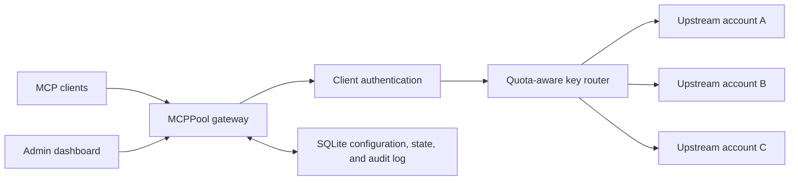

# MCPPool

> Multi-account pooling and quota-aware routing gateway for Model Context Protocol services.

MCPPool exposes one stable MCP endpoint in front of multiple API-key accounts for the same
upstream service. It rotates eligible accounts, enforces configured monthly quotas, persists
account health in SQLite, and fails over only when retrying is safe.

> [!IMPORTANT]
> MCPPool currently targets a simple single-node deployment backed by SQLite. Context7 is the
> first provider adapter.

## Why MCPPool?

A normal reverse proxy knows hosts and connections. MCPPool also understands:

- MCP sessions and JSON-RPC method boundaries
- upstream accounts and encrypted credentials
- account health, cooldowns, and configured monthly quotas
- Gateway API-key authentication
- safe versus ambiguous cross-account retries
- provider-specific quota and authentication signals

## Architecture



The project has two logical paths:

1. **Proxy path** — authenticates clients, selects an eligible account, injects its decrypted
   credential, classifies the result, and streams the upstream response.
2. **Administration path** — manages services, credentials, client keys, quotas, users, settings,
   and request logs.

## Technology stack

| Area | Choice |
| --- | --- |
| Runtime | Python 3.12+ |
| Dependency management | uv |
| HTTP / ASGI | FastAPI, Starlette, Uvicorn |
| Upstream transport | httpx streaming |
| Persistent and runtime state | SQLite + SQLAlchemy async |
| Validation / settings | Pydantic v2 + pydantic-settings |
| Secrets | Fernet encryption for upstream keys; HMAC for Gateway keys |
| Administration UI | React + Vite + nginx |
| Quality | Ruff, mypy, pytest |

See [docs/architecture.md](docs/architecture.md) and the [architecture decisions](docs/adr/) for the reasoning behind these choices.

## Routing model

Each configured API key is currently one independently routed account. Eligible keys are selected
round-robin. A key is excluded when it is disabled, rejected by the upstream, inside a rate-limit
cooldown, or at its configured monthly quota.

Explicit upstream rejections (`401`, `403`, or `429`) may fail over to another account. Ambiguous
failures such as connection loss or `5xx` responses are retried only for HTTP/MCP operations known
to be read-only. `tools/call` is not replayed after an ambiguous failure.

## Context7 official quota status

For Context7 services, the account table can display the upstream request limit, used and
remaining requests, reset time, snapshot age, and the latest safe error state for every key. These
values are kept separate from MCPPool's locally configured `monthly_quota` and request-log count.

Normal Context7 traffic through MCPPool updates the snapshot directly from the same upstream
response, without an extra request. The dashboard then polls only MCPPool's persisted snapshot, so
leaving the page open does not consume Context7 quota. Click **Query now** on a key when there has
been no recent traffic. Context7 exposes API-key quota through the `RateLimit-Limit`,
`RateLimit-Remaining`, and `RateLimit-Reset` response headers; the official HEAD query used to read
those headers consumes one request itself, and the UI confirms that cost before sending it.

Administration endpoints:

- `GET /api/admin/services/{service_id}/quota-status` reads the saved snapshot without contacting
  Context7.
- `POST /api/admin/services/{service_id}/quota-status/refresh?key_id={key_id}` refreshes one key.
  Omitting `key_id` refreshes up to 20 keys in that Context7 service with globally bounded
  concurrency. Per-key singleflight and a short cooldown prevent duplicate refreshes from
  consuming quota.

Context7's web-only teamspace statistics endpoint requires a privileged browser session and does
not accept the `ctx7sk-*` API keys stored by MCPPool. MCPPool therefore never stores Context7
browser cookies, account passwords, or billing-session credentials.

## Development

Prerequisites:

- Python 3.12+
- uv
- Docker with Compose, when running the packaged gateway and dashboard

```bash
cp .env.example .env
uv sync --all-groups
uv run mcp-pool serve --reload
```

Or run the complete local deployment:

```bash
docker compose up -d --build
```

Then open:

- `http://127.0.0.1:8000/health/live`
- `http://127.0.0.1:8000/health/ready`
- `http://127.0.0.1:8000/docs` for a direct development run
- `http://127.0.0.1:3000` for the Docker dashboard
- `http://127.0.0.1:8100/health/ready` for the Docker gateway

Run checks:

```bash
uv run ruff check .
uv run ruff format --check .
uv run mypy src
uv run pytest
```

## Initial roadmap

- [x] Repository and application skeleton
- [x] Streamable HTTP reverse proxy
- [x] SQLite service, credential, state, and audit persistence
- [x] Round-robin account routing with configured monthly quotas
- [x] Context7 provider adapter
- [x] Administration API and dashboard
- [x] Gateway API-key authentication
- [ ] Optional MCP session affinity
- [ ] Metrics and retention controls

## Design principles

- Preserve upstream MCP messages and streaming behavior whenever possible.
- Never log raw credentials, authorization headers, or refresh tokens.
- Keep configuration, cooldowns, quota state, and audit records in SQLite.
- Encrypt upstream credentials using `MCP_POOL_SECRET_KEY`; keep this value stable and backed up,
  because losing it makes stored credentials unreadable.
- Return Gateway API keys only once and store only their HMAC digest.
- Do not retry `tools/call` after an ambiguous upstream outcome.
- Keep provider-specific behavior behind adapters instead of embedding it in the router.
